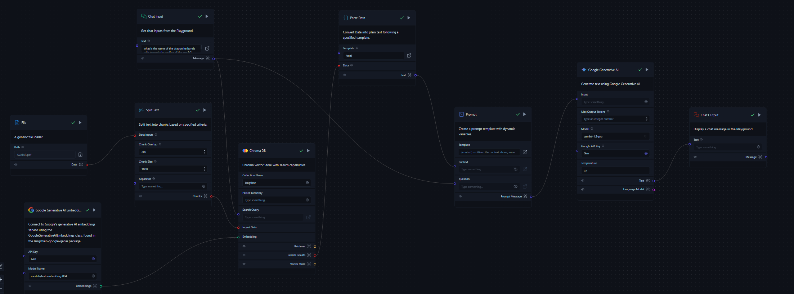

# RAG Chatbot for *Avatar* by James Cameron


<div align="center">
  
</div>

This repository contains a **Retrieval-Augmented Generation (RAG) chatbot** designed to answer questions related to the movie *Avatar* directed by James Cameron. The chatbot was developed using **Langflow**, a tool for designing and deploying language models.

## Features

- **RAG Architecture**: Combines retrieval-based techniques with generative models to provide accurate and context-aware responses.
- **Specialized Knowledge**: Focuses exclusively on the world of *Avatar*—its plot, characters, themes, and production details.
- **Langflow Integration**: Built using the visual interface of Langflow, which makes model design and customization seamless.





## How It Works

The chatbot leverages a **retriever** to search through a document base for relevant passages about *Avatar* and uses a **generator** to form coherent, natural-sounding responses.

### Key Components

1. **Retriever**: Extracts relevant information from the knowledge base, which contains detailed data about the movie.
2. **Generator**: Constructs a human-like response based on the retrieved information.

## Setup Instructions

1. **Clone the Repository**:
    ```bash
    git clone https://github.com/swaraj-khan/Avatar-James-Cameron-RAG-Chatbot.git
    ```


2. **Langflow Configuration**:
    The chatbot configuration has been built using Langflow, and the flow configuration is saved as a JSON file in this repository. You can load this file into Langflow by following these steps:
    
    - Open Langflow and click on **Upload Flow**.
    - Select the `Avatar (James Cameron) RAG Chatbot.json` file.
    - Once uploaded, click **Run** to start the chatbot.

3. **Run the Chatbot**:
    After loading the flow in Langflow, you can start querying the chatbot directly through the interface. It will retrieve relevant information and generate answers related to *Avatar*.

## Example Queries

- "Who directed *Avatar*?"
- "What is the name of the planet in *Avatar*?"
- "How was the visual effects technology developed for *Avatar*?"

## Customization

You can modify the RAG model by adding more documents or training it on a larger corpus of *Avatar*-related data. The JSON file included can also be edited to adjust the pipeline's architecture.

## Contact

For any questions or suggestions, please reach out to [swarajkhan2003@gmail.com].
